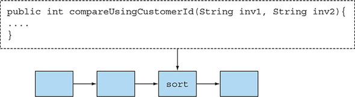
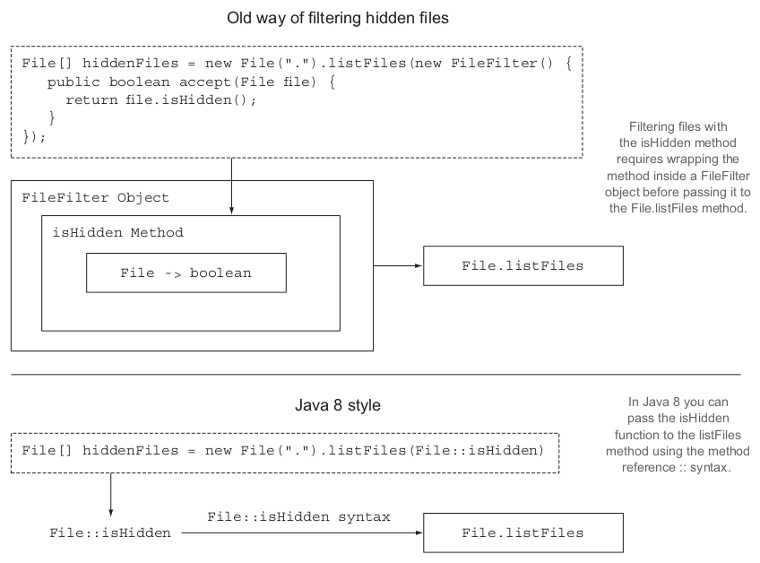

### [CHAPTER 1 자바 8, 9, 10, 11 : 무슨 일이 일어나고 있는가?](https://livebook.manning.com/book/modern-java-in-action/chapter-1/)
#### 1.1 역사의 흐름은 무엇인가?
* 버전별 병렬 실행 환경 변화
    - 자바 1.0
        - 스레드와 락, 메모리 모델 지원
    - 자바 5
        - 스레드 풀, 병렬 실행 컬렉션 도입
    - 자바 7
        - 포크/조인 프레임워크 제공
    - 자바 8
        - 병렬 실행을 새롭고 단순한 방식으로 접근할 수 있는 방법 제공
    - 자바 9
        - 리액티브 프로그래밍이라는 병렬 실행 기법 지원
        - RxJava를 표준적인 방식으로 지원
* 자바8 특징
    - 스트림 API
    - 메서드에 코드를 전달하는 기법(메소드 참조와 람다)
    - 인터페이스의 디폴트 메서드
#### 1.2 왜 아직도 자바는 변화하는가?
* 새로운 언어가 등장하면서 진화하지 않은 기존 언어는 사장되었음
##### 1.2.1 프로그래밍 언어 생태계에서 자바의 위치
* 잘 설계된 객체지향 언어로 시작
    - 스레드와 락을 이용한 동시성도 지원
* JVM 상에서 동작함
    - 브라우저에서 동작함으로써 널리 퍼짐
* 임베디드 컴퓨팅 컴퓨팅 분야를 성공적으로 장악
* 새로운 환경에 적응하기 위해 기능 추가되고 있음
##### 1.2.2 스트림 처리(stream processing)
* 스트림
    - 한 번에 한 개씩 만들어지는 연속적인 데이터 항목들의 모임
    - 프로그램은 이론적으로 한개의 입력 스트림과 출력 스트림을 가짐
    - 한 프로그램의 출력 스트림은 다른 프로그램의 입력 스트림이 될 수 있음
    - 스트림과 관련된 유닉스 명령
        - ```cat file1 file2 | tr "[A-Z]" "[a-z]" | sort | tail -3```
        - 
        - 명령어들을 병렬로 처리함
        - cat이나 tr이 완료되지 않은 시점에서 sort행을 처리하기 시작할 수 있음
* 자바에서의 스트림
    - [java.util.stream 패키지](https://docs.oracle.com/javase/8/docs/api/java/util/stream/Stream.html]) 에 스트림 API 추가
    - ```Stream<T>```는 T형식으로 구성된 일련의 항목을 의미
##### 1.2.3 동작 파라미터화로 메서드에 코드 전달하기
* 동작 파라미터화(behavior parameterization)
    - 코드 일부를 API로 전달하는 기능
    - 메서드를 다른 메서드의 인자로 넘겨주는 기능을 제공
    - 
##### 1.2.4 병렬성과 공유 가변 데이터
* 스트림 메서드로 전달하는 코드는 스레드에 안전해야 함
    - 공유된 가변 데이터에 접근하지 않아야 함
    - 순수(pure) 함수, 부작용 없는(side-effect-free) 함수, 상태 없는(stateless) 함수라 부름
##### 1.2.5 자바가 진화해야 하는 이유
* 언어는 하드웨어나 프로그래머 기대의 변환에 부응하는 방향으로 변화해야 함
#### 1.3 자바 함수
* 프로그래밍 언어의 핵심은 값을 바꾸는 것
    - 이 값을 일급 값(시민)이라 부름
    - 자유롭게 취급 되지 못하는 값은 이급 시민임
* 메서드를 일급 시민으로 만들면 프로그래밍에 유용하게 활용
##### 1.3.1 메서드와 람다를 일급 시민으로
* 메소드 참조(method reference)
    ``` 
    File[] hiddenFiles = new File(".").listFiles(new FileFilter() {
        public boolean accept(File file) {
            return file.isHidden();
        }
    });
    ```
    ``` 
    File[] hiddenFiles = new File(".").listFiles(File::isHidden);
    ```
    - 자바8에서는 더 이상 메서드가 이급값이 아닌 일급값임
    
##### 1.3.2 코드 넘겨주기 : 예제
* 자바 8 이전 필터
    - 녹색 사과 고르기
        ``` 
        public static List<Apple> filterGreenApples(List<Apple> inventory) {
            List<Apple> result = new ArrayList<>();
            for (Apple apple: inventory){
                if (GREEN.equals(apple.getColor())) {
                    result.add(apple);
                }
            }
            return result;
        }
        ```
    - 무게가 150그램 이상인 사과 고르기
        ``` 
        public static List<Apple> filterHeavyApples(List<Apple> inventory) {
            List<Apple> result = new ArrayList<>();
            for (Apple apple: inventory){
                if (apple.getWeight() > 150) {
                    result.add(apple);
                }
            }
            return result;
        }
        ```
* 자바 8
    ```
    public static boolean isGreenApple(Apple apple) {
        return GREEN.equals(apple.getColor());
    }
    public static boolean isHeavyApple(Apple apple) {
        return apple.getWeight() > 150;
    }
    public interface Predicate<T>{
        boolean test(T t);
    }
    static List<Apple> filterApples(List<Apple> inventory, Predicate<Apple> p) {
        List<Apple> result = new ArrayList<>();
        for (Apple apple: inventory){
            if (p.test(apple)) {
                result.add(apple);
            }
        }
        return result;
    }
  
    filterApples(inventory, Apple::isGreenApple);
    filterApples(inventory, Apple::isHeavyApple);
    ```
##### 1.3.3 메서드 전달에서 람다로
* 한두번 사용할 메서드의 정의 없애기
    ``` 
    filterApples(inventory, (Apple a) -> GREEN.equals(a.getColor()) );
    filterApples(inventory, (Apple a) -> a.getWeight() > 150 );
    filterApples(inventory, (Apple a) -> a.getWeight() < 80 || 
                                            RED.equals(a.getColor()) );
    ```
* 람다가 몇 줄 이상으로 길어진다면 메서드 참조를 활용하는 것이 바람직
* 고촬
    - 아래와 같은 형태로 자바에서 지원이 되면 되는것인가?
        ``` 
        static <T> Collection<T> filter(Collection<T> c, Predicate<T> p);
        filter(inventory, (Apple a) -> a.getWeight() > 150);
        ```
        - 병렬성을 위해 위와 같은 설계를 포기
        - 스트림 API를 제공
#### 1.4 스트림
* 고가의 거래만 필터링하고 사용한 통화로 결과를 그룹핑하기
    - 자바 8 이전
        ``` 
        Map<Currency, List<Transaction>> transactionsByCurrencies = new HashMap<>();
        for (Transaction transaction : transactions) {
            if(transaction.getPrice() > 1000){
                Currency currency = transaction.getCurrency();
                List<Transaction> transactionsForCurrency =
                    transactionsByCurrencies.get(currency);
                if (transactionsForCurrency == null) {
                    transactionsForCurrency = new ArrayList<>();
                    transactionsByCurrencies.put(currency, transactionsForCurrency);
                }
                transactionsForCurrency.add(transaction);
            }
        }
        ```
        - 외부 반복(external iteration)
    - 자바 8
        ``` 
        Map<Currency, List<Transaction>> transactionsByCurrencies =
            transactions.stream()
                        .filter((Transaction t) -> t.getPrice() > 1000)
                        .collect(groupingBy(Transaction::getCurrency)); 
        ```
        - 내부 반복(internal iteration, 4장 참고)
##### 1.4.1 멀티스레딩은 어렵다
* 스트림 API는 컬렉션을 처리하면서 발생하는 문제와 멀티코어 활용 어려운 문제를 해결
    - 
* 컬렉션은 데이터를 어떻게 저장하고 접근할지에 중점을 둠
* 스트림은 데이터를 어떻게 다룰지에 중점을 둠
#### 1.5 디폴트 메서드와 자바 모듈
* Collections.sort(list, comparator) vs list.sort(comparator)
    - 기존 인터페이스의 변경 문제
    - 자바 8에서는 디폴트 메서드(default method)로 이 문제를 해결
* 디폴토 메서드
    - 기존의 코드를 건드리지 않고도 원래의 인터페이스 설계를 자유롭게 확장할 수 있음
    - 다이아몬드 상속 문제를 해결해야 함(9장)
#### 1.6 함수형 프로그래밍에서 가져온 다른 유용한 아이디어
* NullPointerException을 피할 수 잇는 Optional<T> 클래스를 제공
* 패턴 매칭 기법
    - 스칼라 예제
    ``` 
    def simplifyExpression(expr: Expr): Expr = expr match {
        case BinOp("+", e, Number(0)) => e
        case BinOp("-", e, Number(0)) => e
        case BinOp("*", e, Number(1)) => e
        case BinOp("/", e, Number(1)) => e
        case _ => expr
    }
    ```
#### 1.7 마치며