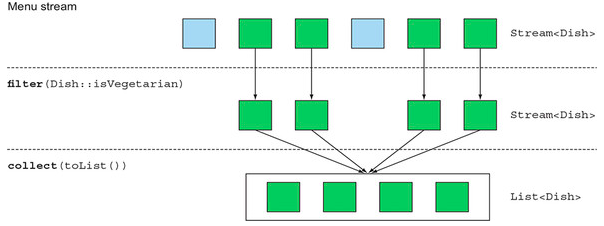
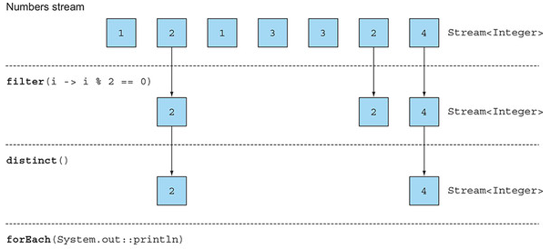
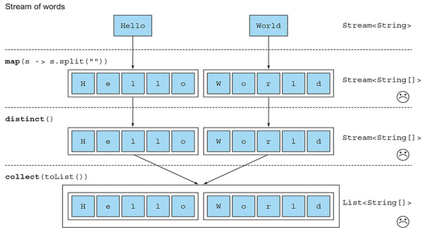
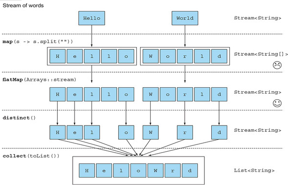
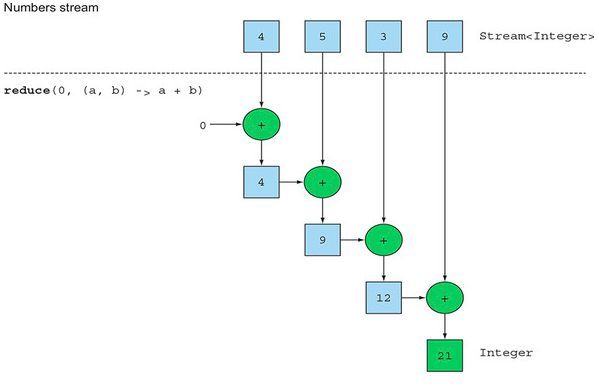
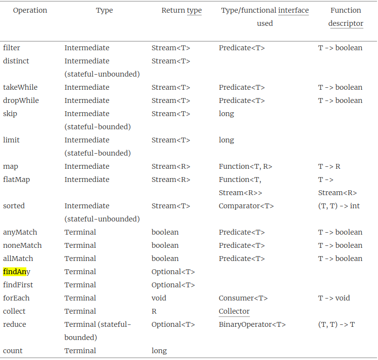

### [CHAPTER 5 스트림 활용](https://livebook.manning.com/book/modern-java-in-action/chapter-5/)
* 이 장의 내용
    - 필터링, 슬라이싱, 매칭
    - 검색, 매칭, 리듀싱
    - 특정 범위의 숫자와 같은 숫자 스트림 사용하기
    - 다중 소스로부터 스트림 만들기
    - 무한 스트림

#### 5.1 필터링
##### 5.1.1 프레디케이트로 필터링
* [filter 메서드](https://docs.oracle.com/javase/8/docs/api/java/util/stream/Stream.html#filter-java.util.function.Predicate-)
    - 프레디케이트와 일치하는 모든 요소를 포함하는 스트림을 반환
    ```
    List<Dish> vegetarianMenu = menu.stream()
                                    .filter(Dish::isVegetarian)
                                    .collect(toList());
    ``` 
    - 
##### 5.1.2 고유 요소 필터링
* [distinct 메서드](https://docs.oracle.com/javase/8/docs/api/java/util/stream/Stream.html#distinct--)
    - 고유 요소로 이루어진 스트림을 반환
    - 

#### 5.2 스트림 슬라이싱
##### 5.2.1 프레디케이트를 이용한 슬라이싱
* [takeWhile 메서드](https://docs.oracle.com/javase/9/docs/api/java/util/stream/Stream.html#takeWhile-java.util.function.Predicate-) 
    - 프레디케이트를 적용해 거짓이 나올때 반복 스트림을 중단
    ``` 
    List<Dish> slicedMenu1
        = specialMenu.stream()
                     .takeWhile(dish -> dish.getCalories() < 320)
                     .collect(toList());
    ```
* [dropWhile 메서드](https://docs.oracle.com/javase/9/docs/api/java/util/stream/Stream.html#dropWhile-java.util.function.Predicate-)
    - 프레디케이트를 적용해 참이 나올때 반복 스트림을 중단
    ```
    List<Dish> slicedMenu2
        = specialMenu.stream()
                     .dropWhile(dish -> dish.getCalories() < 320)
                     .collect(toList()); 
    ```
* 특징
    - java 9 에 도입
    - 스트림에 프레디케이트를 이용해 스트림을 슬라이스
    - 정렬되어져 있어야 함
    - 무한 스트림에도 적용 가능
##### 5.2.2 스트림 축소
* [limit 메서드](https://docs.oracle.com/javase/8/docs/api/java/util/stream/Stream.html#limit-long-)
    - 주어진 값 이하의 크기를 갖는 새로운 스트림을 반환
    ``` 
    List<Dish> dishes = specialMenu
                            .stream()
                            .filter(dish -> dish.getCalories() > 300)
                            .limit(3)
                            .collect(toList());
    ```
##### 5.2.3 요소 건너뛰기
* [skip 메서드](https://docs.oracle.com/javase/8/docs/api/java/util/stream/Stream.html#skip-long-)
    - 처음 n개 요소를 제외한 스트림을 반환
    ``` 
    List<Dish> dishes = menu.stream()
                            .filter(d -> d.getCalories() > 300)
                            .skip(2)
                            .collect(toList());
    ```
  
#### 5.3 매핑
##### 5.3.1 스트림의 각 요소에 함수 적용하기
* [map 메소드](https://docs.oracle.com/javase/8/docs/api/java/util/stream/Stream.html#map-java.util.function.Function-)
    - 함수를 인자로 받으며 각 요소에 적용되어 새로운 요소로 매핑
    - mapping vs transforming
    - new version vs modify
    ``` 
    List<String> words = Arrays.asList("Modern", "Java", "In", "Action");
    List<Integer> wordLengths = words.stream()
                                     .map(String::length)
                                     .collect(toList());
    ```
##### 5.3.2 스트림 평면화
* 스트림 평면화란?
    - ["Hello","World"] 리스트를 ["H","e","l","l","o","W","o","r","l","d"] 로 변환 시도
    ``` 
    words.stream()
         .map(word -> word.split(""))
         .distinct()
         .collect(toList());
    ```
    - 무엇이 문제인가?
    
        - Stream<String[]>로 변환됨
    - map과 Arrays.stream 활용해 보기
    ``` 
    words.stream()
         .map(word -> word.split(""))
         .map(Arrays::stream)
         .distinct()
         .collect(toList());
    ```
        - List<Stream<String>> 자료형이 만들어짐
    - flatMap 메서드 활용
        ``` 
        List<String> uniqueCharacters =
          words.stream()
               .map(word -> word.split(""))
               .flatMap(Arrays::stream)
               .distinct()
               .collect(toList());
        ```
        - 각 배열을 스트림으로 매핑(List<Stream<String>>)하는 것이 아니라 스트림의 내용(List<String>)으로 매핑
        - 스트림의 값을 다른 스트림으로 변환 후, 각각의 스트림을 하나의 스트림으로 연결
        - 
#### 5.4 검색과 매칭
##### 5.4.1 프레디케이트가 적어도 한 요소와 일치하는지 확인
* [anyMatch 메서드](https://docs.oracle.com/javase/8/docs/api/java/util/stream/Stream.html#anyMatch-java.util.function.Predicate-)
    - 적어도 한 요소가 프레디케이트와 일치하는지 확인
##### 5.4.2 프레디케이트가 모든 요소와 일치하는지 검사
* [allMatch 메서드](https://docs.oracle.com/javase/8/docs/api/java/util/stream/Stream.html#allMatch-java.util.function.Predicate-)
    - 모든 요소가 프레디케이트와 일치하는지 확인
* [nonMatch 메서드](https://docs.oracle.com/javase/8/docs/api/java/util/stream/Stream.html#noneMatch-java.util.function.Predicate-)
    - 프레디케이와 일치하는 요소가 없는지 확인
* anyMatch, allMatch, noneMatch는 쇼트서킷 기법 적용
##### 5.4.3 요소 검색
* [findAny 메서드](https://docs.oracle.com/javase/8/docs/api/java/util/stream/Stream.html#findAny--)
    - 스트림에서 임의의 요소를 반환
    ``` 
    Optional<Dish> dish =
      menu.stream()
          .filter(Dish::isVegetarian)
          .findAny();
    ```
##### 5.4.4 첫번째 요소 찾기
* [findFirst 메서드](https://docs.oracle.com/javase/8/docs/api/java/util/stream/Stream.html#findFirst--)
    - 스트림에서 첫번째 요소 반환
    ``` 
    List<Integer> someNumbers = Arrays.asList(1, 2, 3, 4, 5);
    Optional<Integer> firstSquareDivisibleByThree =
      someNumbers.stream()
                 .map(n -> n * n)
                 .filter(n -> n % 3 == 0)
                 .findFirst(); // 9
    ``` 
* 병렬 스트림에서는 첫번째 요소를 찾기가 어려움
    - 병렬 스트림에서는 findAny를 주로 사용

#### 5.5 리듀싱
* 리듀싱 이란
    - 모든 스트림 요소를 처리해서 값을 도출
    - 함수형 프로그래밍에서는 ```폴드(fold)```라고 부름
##### 5.5.1 요소의 합
* [reduce 메서드](https://docs.oracle.com/javase/8/docs/api/java/util/stream/Stream.html#reduce-T-java.util.function.BinaryOperator-)
    - ```T reduce(T identity, BinaryOperator<T> accumulator)```
        ``` 
        Integer sum = numbers.reduce(0, (a, b) -> a+b);
        or:
        Integer sum = numbers.reduce(0, Integer::sum);
        ```
        - 
    - ```Optional<T> reduce(BinaryOperator<T> accumulator)```
        ```
        Optional<Integer> sum = numbers.stream().reduce((a, b) -> (a + b)); 
        ```
##### 5.5.2 최댓값과 최소값
* 최대값
    ```
    Optional<Integer> max = numbers.stream().reduce(Integer::max);
    ```
* 최소값
    ```
    Optional<Integer> max = numbers.stream().reduce(Integer::min);
    ```
* reduce 메서드의 장점
    - 내부 반복이 추상화 되면서 병렬로 reduce를 실행
    ``` 
    int sum = numbers.parallelStream().reduce(0, Integer::sum);
    ```
* 스트림 연산 : stateless vs stateful
    - stateless
        - map, filter 등은 내부적인 가변 상태를 갖지 않음
    - bounded(한정)
        - reduce, sum, max는 요소의 수와 상관 없이 내부 상태의 크기는 한정되어져 있음
    - statefull
        - sorted, distinct 연산은 다수의 요수가 버퍼에 추가될 수 있음
        - 데이터 스트림이 크거나 무한 스트림이라면 문제 발생할 수 있음
* 스트림 API 정리
    - 
#### 5.6 실전 연습
1. 2011년에 일어난 모든 트랜잭션을 찾아 값을 오름차순으로 정리
2. 거래자가 근무하는 모든 도시를 중복 없이 나열
3. 케임브리지에서 근무하는 모든 거래자를 찾아 이름순으로 정렬
4. 모든 거래자의 이름을 알파벳순으로 정렬
5. 밀라노에 거래자가 있는가?
6. 케임브리지에 거주하는 거래자의 모든 트랜잭션값을 출력
7. 전체 트랜잭션 중 최댓값
8. 전체 트랜잭션 중 최소값
##### 5.6.1 거래자와 트랜잭션
* [Trader](../../../src/main/java/com/study/modern/ch05/Trader.java)
* [Transaction](../../../src/main/java/com/study/modern/ch05/Transaction.java)
##### 5.6.2 실전 연습 정답
* [Exercise](../../../src/test/java/com/study/modern/ch05/ExerciseTest.java)

#### 5.7 숫자형 스트림
##### 5.7.1 기본형 특화 스트림
##### 5.7.2 숫자 범위
##### 5.7.3 숫자 스트림 활용 : 피타고라스 수

#### 5.8 스트림 만들기
##### 5.8.1 값으로 스트림 만들기
##### 5.8.2 null이 될 수 있는 객체로 스트림 만들기
##### 5.8.3 배열로 스트림 만들기
##### 5.8.4 파일로 스트림 만들기
##### 5.8.5 함수로 무한 스트림 만들기

#### 5.9 마치며 