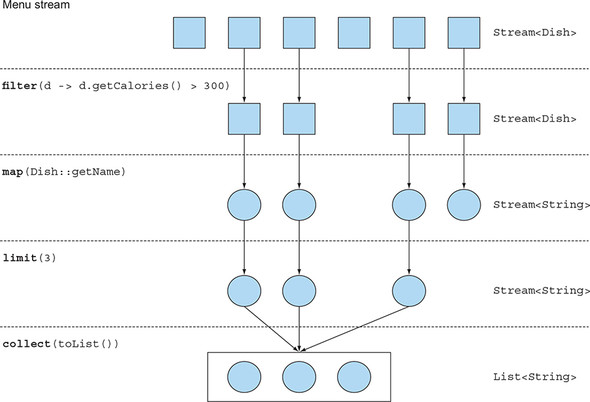
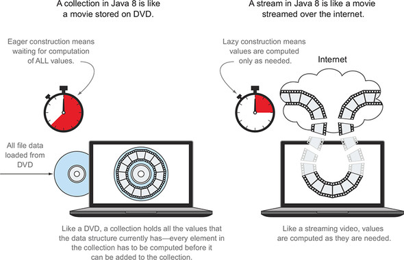
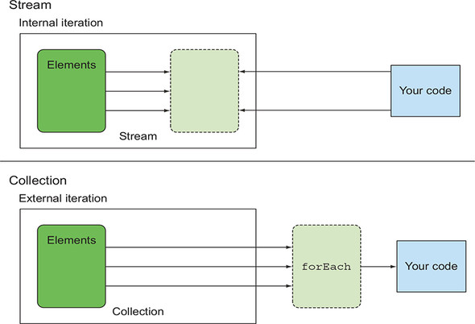

### [CHAPTER 4 스트림 소개](https://livebook.manning.com/book/modern-java-in-action/chapter-4/)
* 이 장의 내용
    - 스트림이란 무엇인가?
    - 컬렉션과 스트림
    - 내부 반복과 외부 반복
    - 중간 연산과 최종 연산
#### 4.1 스트림이란 무엇인가?
* 스트림!!!
    - 어떻게 보단 무엇에 집중
    - 선언형으로 컬렉션 데이터 처리
    - 멀티스레드 코드 없이 투명하게 병렬 처리
* 자바7 코드
```
// 400 칼로리 이하
List<Dish> lowCaloricDishes = new ArrayList<>();
for(Dish dish: menu) {
    if(dish.getCalories() < 400) {
        lowCaloricDishes.add(dish);
    }
}
// 칼로리로 정렬
Collections.sort(lowCaloricDishes, new Comparator<Dish>() {
    public int compare(Dish dish1, Dish dish2) {
        return Integer.compare(dish1.getCalories(), dish2.getCalories());
    }
});
// 음식 이름 추출
List<String> lowCaloricDishesName = new ArrayList<>();
for(Dish dish: lowCaloricDishes) {
    lowCaloricDishesName.add(dish.getName());
}
```
* 자바8 코드
``` 
List<String> lowCaloricDishesName =
               menu.stream()
                   .filter(d -> d.getCalories() < 400)
                   .sorted(comparing(Dish::getCalories))
                   .map(Dish::getName)
                   .collect(toList());
```
* 병렬 처리(7장 참고)
``` 
List<String> lowCaloricDishesName =
               menu.parallelStream()
                   .filter(d -> d.getCalories() < 400)
                   .sorted(comparing(Dish::getCalories))
                   .map(Dish::getName)
                   .collect(toList());


```
* 스트림의 이점
    - 선언형으로 코드 구현
    - filter, sorted, map, collect 같은 연산을 연결해 파이프라인을 만들 수 있음
    
* 스트림 API의 특징
    - 선언형 : 간결하고 가독성이 좋음
    - 조립할 수 있음 : 유연성이 좋음
    - 병렬화 : 성능 향상
* [Dish 클래스](../../src/main/java/com/study/modern/ch04/Dish.java)
#### 4.2 스트림 시작하기
* 스트림이란?
    - 데이터 처리 연산을 지원하도록 소스에서 추출된 연속된 요소(Sequence of element)
        - 연속된 요소
            - 컬렉션과 마찬가지로 연속된 값 집합의 인터페이스를 제공
            - 컬렉션은 복잡성과 관련된 요소 저장 및 접근 연산이 주를 이룸(LinkedList를 쓸까 ArrayList를 쓸까?)
            - 스트림은 계산식에 집중
        - 소스
            - 컬렉션, 배열, I/O 자원 등의 데이터 제공 소스로부터 데이터 소비
            - 컬렉션의 정렬 상태를 유지함
        - 데이터 처리 연상
            - 데이터베이스와 비슷한 연산 지원
            - ex) filter, map, reduce, find, match, sort 등
* 스트림의 주요 특징
    - 파이프라이닝(pipelining)
        - 스트림 연산끼리 연결해서 커다란 파이프라인을 구성할 수 있도록 스트림 자신을 반환
        - lazyness와 short-circuiting 지원
    - 내부 반복
    ``` 
    List<String> threeHighCaloricDishNames =
      menu.stream()
          .filter(dish -> dish.getCalories() > 300)
          .map(Dish::getName)
          .limit(3)
          .collect(toList());
    System.out.println(threeHighCaloricDishNames);
    ```
    - 
#### 4.3 스트림과 컬렉션
* 스트림과 컬렉션 비교
    - 컬렉션의 모든 요소는 컬렉션에 추가하기 전에 계산되어야 함
    - 스트림은 요청할 때만 요소를 계산하는 ```고정된(fixed)``` 자료구조(add, remove 불가)
    - 모든 소수를 구하라!!!
        - 컬렉션은 결과를 볼 수가 없음
        - 스트림은 사용자가 원하는 결과만 추출해 낼 수 있음
    - 
##### 4.3.1 딱 한 번만 탐색할 수 있다
* 반복자와 마찬가지로 스트림도 한 번만 탐색 가능
``` 
List<String> title = Arrays.asList("Modern", "Java", "In", "Action");
Stream<String> s = title.stream();
s.forEach(System.out::println);
s.forEach(System.out::println); // java.lang.IllegalStateException 발생
```
##### 4.3.2 외부 반복과 내부 반복
* 내부 반복과 외부 반복
    - 마리오와 소피아(147p 참고)
    - for-each 외부 반복
    ``` 
    List<String> names = new ArrayList<>();
    for(Dish dish: menu) {
        names.add(dish.getName());
    }
    ```
    - iterator 외부 반복
    ``` 
    List<String> names = new ArrayList<>();
    Iterator<String> iterator = menu.iterator();
    while(iterator.hasNext()) {
        Dish dish = iterator.next();
        names.add(dish.getName());
    }
    ```
    - 스트림 내부 반복
    ``` 
    List<String> names = menu.stream()
                             .map(Dish::getName)
                             .collect(toList());
    ```
    - 
* 퀴즈1
    - 
#### 4.4 스트림 연산
* 중간 연산(intermediate operation)
    - 연결할 수 있는 스트림 연산
* 최종 연산(terminal operation)
    - 스트림을 닫는 연산
* 
##### 4.4.1 중간 연산
* 300칼로리 이상인 요리명
``` 
List<String> names =
    menu.stream()
        .filter(dish -> {
                          System.out.println("filtering:" + dish.getName());
                          return dish.getCalories() > 300;
                     })
        .map(dish -> {
                       System.out.println("mapping:" + dish.getName());
                       return dish.getName();
                  })
        .limit(3)
        .collect(toList());
System.out.println(names);
```
* 결과
``` 
filtering:pork
mapping:pork
filtering:beef
mapping:beef
filtering:chicken
mapping:chicken
[pork, beef, chicken]
```
* lazy의 나비 효과
    - short-circuit
        - limit에 의해 정해진 요소를 다 찾으면 끝냄
    - loop fusion
        - filter와 map이 병합
##### 4.4.2 최종 연산
* 퀴즈
    - 
##### 4.4.3 스트림 이용하기
* 스트림 이용 과정
    - 질의를 수행할 데이터 소스
    - 스트림 파이프라인을 구성할 중간 연산 연결
    - 스트림 파이프라인을 실행하여 결과를 만들 최종 연산
* 빌더패턴과 비슷
* 중간 연산
    - 
* 최종 연산
    - 

#### 4.5 로드맵
#### 4.6 마치며