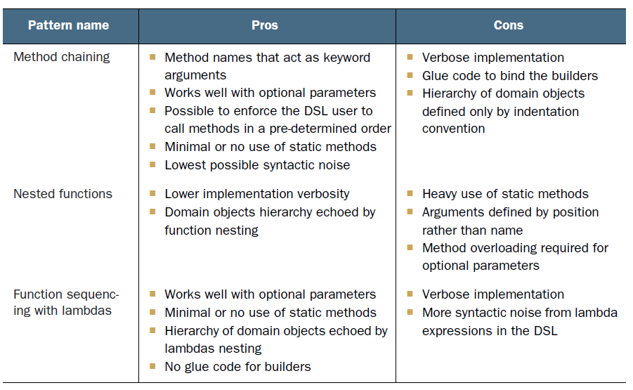

### [CHAPTER 10 람다를 이용한 도메인 전용 언어](https://livebook.manning.com/book/modern-java-in-action/chapter-10/)

* 이 장의 내용
    - 도메인 전용 언어(domain specific languages, DSL)란 무엇이며 어떤 형식으로 구성되는가?
    - DSL을 API에 추가할 때의 장단점
    - JVM에서 활용할 수 있는 자바 기반 DSL을 깔끔하게 만드는 대안
    - 최신 자바 인터페이스의 클래스와 클래스에 적용된 DSL에서 배움
    - 효과적인 자바 기반 DSL을 구현하는 패턴과 기법
    - 이들 패턴을 자바 라이브러리와 도구에서 얼마나 흔히 사용하는가?
* DSL
    - 특정 도메인을 대상으로 만들어진 특수 프로그래밍 언어
    - 개발자와 도메인 전문가 사이의 간격을 좁히는 것이 목표

* external DSL
    - 타 언어로 작성된 DSL
    - ex> SQL
* internal DSL
    - 같은 언어로 작성된 DSL
    - ex> 스트림 API
        - 플루언트 스타일(fluent style)
    
#### 10.1 도메인 전용 언어
* DSL의 특징
    - 코드의 의도가 명확시 전달되어야 함
    - 가독성이 좋아야 함
    
##### 10.1.1 DSL의 장점과 단점
* DSL의 장점
    - 간결함
    - 가독성
    - 유지보수
    - 높은 수준의 추상화
    - 집중
    - 관심사 분리
* DSL의 단점
    - DSL 설계의 어려움
    - 개발 비용
    - 추가 우회 계층
    - 새로 배워야 하는 언어
    - 호스팅 언어 한계

##### 10.1.2 JVM에서 이용할 수 있는 다른 DSL 해결책
* 내부 DSL
    - 기존 호스팅 언어를 기반으로 구현
    - 임베디드 DSL로 불림
* 외부 DSL
    - 호스팅 언어와는 독립적으로 구현
    - standalone이라 불림
* 다중 DSL
    - JVM에서 실행되는 유연한 언어를 활용
    - 코틀린이나 스칼라의 경우 간결한 DSL을 만드는데 필요한 문법을 지원
    - [코틀린 예제](https://github.com/sajacaros/KotilinInAction/tree/master/src/study/ch11)

#### 10.2 최신 자바 API의 작은 DSL
* 람다와 메서드 참조의 등장
    - ex> Comparator 인터페이스
    ``` 
    Collections.sort(persons, new Comparator<Person>() {
        public int compare(Person p1, Person p2) {
            return p1.getAge() - p2.getAge();
        }
    });
    ```
    - 람다 표현식 적용
    ``` 
    Collections.sort(persons, (p1, p2) -> p1.getAge() - p2.getAge());
    ```
    - Comparator.comparing 메서드 적용
    ``` 
    Collections.sort(persons, comparing(p -> p.getAge()));
    ```
    - 메서드 참조 적용
    ``` 
    Collections.sort(persons, comparing(Person::getAge));
    ```
    - 역순 정렬
    ``` 
    Collections.sort(persons, comparing(Person::getAge).reverse());
    ```
    - 나이 정렬 후 나이가 같을시 이름순 정렬
    ```
    Collections.sort(persons, comparing(Person::getAge)
                              .thenComparing(Person::getName)); 
    ```
    - List 디폴트 sort함수 활용
    ``` 
    persons.sort(comparing(Person::getAge)
                 .thenComparing(Person::getName));
    ```
##### 10.2.1 스트림 API는 컬랙션을 조작하는 DSL
* Error가 들어간 40개 문장 읽기
``` 
List<String> errors = new ArrayList<>();
int errorCount = 0;
BufferedReader bufferedReader
    = new BufferedReader(new FileReader(fileName));
String line = bufferedReader.readLine();
while (errorCount < 40 && line != null) {
    if (line.startsWith("ERROR")) {
        errors.add(line);
        errorCount++;
    }
    line = bufferedReader.readLine();
}
```
* 컬랙션을 조작하는 DSL 활용
``` 
List<String> errors = Files.lines(Paths.get(fileName))
                           .filter(line -> line.startsWith("ERROR"))
                           .limit(40)
                           .collect(toList());
```
##### 10.2.2 데이터를 수집하는 DSL인 Collectors
* 브랜드 별로 그룹화 후 색상별 그룹화
    ``` 
    Map<String, Map<Color, List<Car>>> carsByBrandAndColor =
            cars.stream().collect(groupingBy(Car::getBrand,
                                             groupingBy(Car::getColor)));
    ```
    - 플루언트 스타일과의 비교
    ``` 
    Comparator<Person> comparator =
            comparing(Person::getAge).thenComparing(Person::getName);
    ```
    * 플루언트 스타일 구현하기
        - 사용 예쩨
        ``` 
        Collector<? super Car, ?, Map<Brand, Map<Color, List<Car>>>>
           carGroupingCollector =
               groupOn(Car::getColor).after(Car::getBrand).get()
        ```
        - 그룹핑 빌더
        ```
        public class GroupingBuilder<T, D, K> {
            private final Collector<? super T, ?, Map<K, D>> collector;
        
            private GroupingBuilder(Collector<? super T, ?, Map<K, D>> collector) {
                this.collector = collector;
            }
        
            public Collector<? super T, ?, Map<K, D>> get() {
                return collector;
            }
        
            public <J> GroupingBuilder<T, Map<K, D>, J>
                               after(Function<? super T, ? extends J> classifier) {
                return new GroupingBuilder<>(groupingBy(classifier, collector));
            }
        
            public static <T, D, K> GroupingBuilder<T, List<T>, K>
                             groupOn(Function<? super T, ? extends K> classifier) {
                return new GroupingBuilder<>(groupingBy(classifier));
            }
        }
        ```
#### 10.3 자바를 DSL을 만드는 패턴과 기법
* [기본 모델](../../src/main/java/com/study/modern/ch10/model)
* [main](../../src/main/java/com/study/modern/ch10/pure/PureMain.java)
##### 10.3.1 메서드 체인
* [main](../../src/main/java/com/study/modern/ch10/methodchain/MethodChainingMain.java)
* [구현 소스](../../src/main/java/com/study/modern/ch10/methodchain/MethodChainingOrderBuilder.java)
* 특징
    - 플루언트 스타일을 쓰게끔 강제함
    - 빌더를 구현해야 함
    - 들여쓰기를 강제하지 못함
##### 10.3.2 중첩된 함수 이용
* [main](../../src/main/java/com/study/modern/ch10/nested/NestedFunctionMain.java)
* [구현 소스](../../src/main/java/com/study/modern/ch10/nested/NestedFunctionOrderBuilder.java)
* 특징
    - 도메인 객체 계층 구조를 그대로 반영
    - 많은 괄호를 사용해야 함
    - 인수의 의미가 이름이 아니라 위치에 의존적임
    - at(), on()과 같은 더미 함수로 완화 시킬 수 있음
##### 10.3.3 람다 표현식을 이용한 함수 시퀀싱
* [main](../../src/main/java/com/study/modern/ch10/lambda/LambdaMain.java)
* [구현 소스](../../src/main/java/com/study/modern/ch10/lambda/LambdaOrderBuilder.java)
* 특징
    - 플루언트 방식으로 거래 주문 정의
    - 도메인 객체의 계층 구조 유지
    - 람다 표현식 문법안에서 설정이 이루어 져야함 

##### 10.3.4 조합하기
* [main](../../src/main/java/com/study/modern/ch10/mixed/MixedMain.java)
* [구현 소스](../../src/main/java/com/study/modern/ch10/mixed/MixedOrderBuilder.java)
* 특징
    - 여러 패턴의 장점을 활용
    - DSL 문법을 익히는데 오래 걸림

##### 10.3.5 DSL에 메서드 참조 사용하기
* 세금 모델
    ``` 
    public class Tax {
        public static double regional(double value) {
            return value * 1.1;
        }
    
        public static double general(double value) {
            return value * 1.3;
        }
    
        public static double surcharge(double value) {
            return value * 1.05;
        }
    }
    ```
* 세금 적용
    ``` 
    public static double calculate(Order order, boolean useRegional,
                                   boolean useGeneral, boolean useSurcharge) {
        double value = order.getValue();
        if (useRegional) value = Tax.regional(value);
        if (useGeneral) value = Tax.general(value);
        if (useSurcharge) value = Tax.surcharge(value);
        return value;
    }
    ```
* 사용 예
    ``` 
    double value = calculate(order, true, false, true);
    ```
    - 가독성이 떨어짐
    - 불리언 변수의 사용 순서를 인지하고 있어야 함
    - 어떤 세금이 적용됐는지도 알기 어려움
* 체이닝 방식을 이용한 리팩토링
    ```
    public class TaxCalculator {
        private boolean useRegional;
        private boolean useGeneral;
        private boolean useSurcharge;
    
        public TaxCalculator withTaxRegional() {
            useRegional = true;
            return this;
        }
    
        public TaxCalculator withTaxGeneral() {
            useGeneral= true;
            return this;
        }
    
        public TaxCalculator withTaxSurcharge() {
            useSurcharge = true;
            return this;
        }
    
        public double calculate(Order order) {
            return calculate(order, useRegional, useGeneral, useSurcharge);
        }
    }
    ```
* 사용 예
    ``` 
    double value = new TaxCalculator().withTaxRegional()
                                      .withTaxSurcharge()
                                      .calculate(order);
    ```
    - 코드가 장황함
    - 각 세금에 해당하는 불리언 필드가 필요하므로 확장성도 제한적
* 함수형 기능을 이용한 리팩토링
    ``` 
    public class TaxCalculator {
        public DoubleUnaryOperator taxFunction = d -> d;
    
        public TaxCalculator with(DoubleUnaryOperator f) {
            taxFunction = taxFunction.andThen(f);
            return this;
        }
    
        public double calculate(Order order) {
            return taxFunction.applyAsDouble(order.getValue());
        }
    }
    ```
* 사용예
    ``` 
    double value = new TaxCalculator().with(Tax::regional)
                                      .with(Tax::surcharge)
                                      .calculate(order);
    ```
#### 10.4 실생활의 자바 8 DSL

##### 10.4.1 jOOQ
##### 10.4.2 큐컴버
##### 10.4.3 스프링 통합

#### 10.5 마치며
