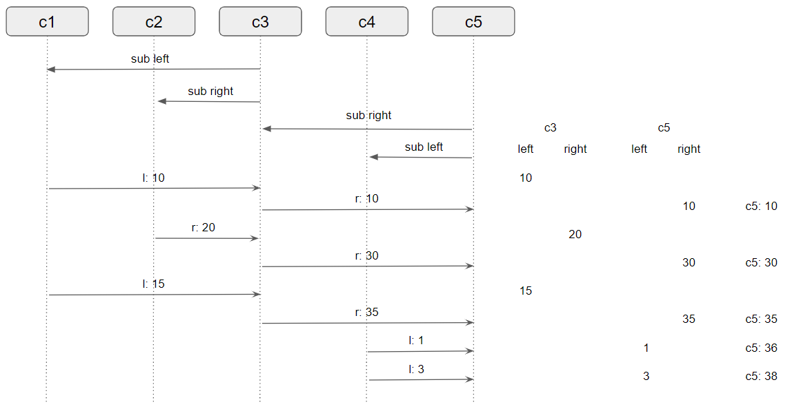

### [CHAPTER 15 CompletableFuture와 리액티브 프로그래밍 컨셉의 기초](https://livebook.manning.com/book/modern-java-in-action/chapter-15/)
* 이장의 내용
    - 풍부한 동시성 API를 제공하게 하는 진화의 힘
    - 비동기 API
    - The boxes-and-channels 화면
    - 박스를 동적으로 연결하는 CompletableFuture combinators
    - java9 Flow API에 기반한 pub/sub 구조
    - reactive programming and reactive systems

* 동시성 vs 병렬성
    - 동시성
        - 단일 코어 머신에서 발생할 수 있는 프로그래밍 속성
    - 병렬성
        - 병렬 실행을 하드웨어 수준에서 지원
    -   
#### 15.1 동시성을 구현하는 자바 지원의 진화
* history
    - initial : Runnable, Thread
    - 자바 5 : ExecutorService, Callable<T>, Future<T>
    - 자바 7 : Fork/Join framework, RecursiveTask
    - 자바 8 : 스트림 기반 병렬 프로세싱 추가, CompletableFuture
    - 자바 9 : Flow
##### 15.1.1 스레드와 높은 수준의 추상화
##### 15.1.2 Executor와 스레드 풀
* 태스크 제출과 실행을 분리할 수 있는 기능을 제공
* 스레드의 문제
    - 생성할 수 있는 스레드의 수를 초과하면 예상치 못한 방식으로 동작
* 스레드 풀의 도입
    - [ThreadPoolExecutor class](https://docs.oracle.com/javase/8/docs/api/java/util/concurrent/ThreadPoolExecutor.html)
        - [분석](https://www.logicbig.com/tutorials/core-java-tutorial/java-multi-threading/thread-pools.html)
        - 워커 스레드들을 스레드 풀에 저장
* 스레드 풀의 단점
    - k 스레드를 가진 스레드 풀은 오직 k만큼의 스레드를 동시에 실행
        - 잠을 자거나 I/O를 기다리거나 네트워크 연결을 기다리는 태스크는 주의
    - 프로그램을 종료하기 전에 모든 스레드 풀을 종료해야 함
##### 15.1.3 스레드의 다른 추상화: 중첩되지 않은 메서드 호출
* strict fork/join
    - 
* relaxed fork/join
    - 
* asynchronous method
    - 
    - 메소드가 반환된 후에도 태스크의 실행이 계속되는 메서드를 비동기 메서드라 함
    - 자바 8,9에서 관련 메서드를 제공
##### 15.1.4 스레드에 무엇을 바라는가?
* 모든 하드웨어 스레드를 활용해 병렬성의 장점을 극대화하도록 프로그램 구조를 만듬

#### 15.2 동기 API와 비동기 API
* f와 g 메소드의 호출을 합하는 예제
    ``` 
    int y = f(x);
    int z = g(x);
    log.info({},y+z); 
    ```
* 스레드를 통한 개선
    ```
    class ThreadExample {
        public static void main(String[] args) throws InterruptedException {
            int x = 1337;
            Result result = new Result();
    
            Thread t1 = new Thread(() -> { result.left = f(x); } );
            Thread t2 = new Thread(() -> { result.right = g(x); });
            t1.start();
            t2.start();
            t1.join();
            t2.join();
            log.info("{}", result.left + result.right);
        }
    
        private static class Result {
            private int left;
            private int right;
        }
    }
    ```
* Future를 이용한 개선
    ```
    public class ExecutorServiceExample {
     public static void main(String[] args)
         throws ExecutionException, InterruptedException {
         int x = 1337;
    
         ExecutorService executorService = Executors.newFixedThreadPool(2);
         Future<Integer> y = executorService.submit(() -> f(x));
         Future<Integer> z = executorService.submit(() -> g(x));
         System.out.println(y.get() + z.get());
    
         executorService.shutdown();
     }
    }
    ```
##### 15.2.1 Future 형식 API
* Future를 이용한 f와 g의 시그니쳐 변경
    ```
    Future<Integer> f(int x);
    Future<Integer> g(int x);
    ```
##### 15.2.2 리액티브 형식 API
* 콜백을 이용한 f와 g의 시그니쳐 변경
    ``` 
    void f(int x, IntConsumer dealWithResult);
    void g(int x, IntConsumer dealWithResult);
    ```
    - 예제
    ``` 
    public class CallbackStyleExample {
        public static void main(String[] args) {
            int x = 1337;
            Result result = new Result();
    
            f(x, (int y) -> {
                result.left = y;
                System.out.println((result.left + result.right));
            } );
    
            g(x, (int z) -> {
                result.right = z;
                System.out.println((result.left + result.right));
            });
        }
    }
    ```
    - 상황에 따라 먼저 계산된 결과가 출력
##### 15.2.3 잠자기(그리고 기타 블로킹 동작)는 해로운 것으로 간주
* Code A
    ```
    work1();
    Thread.sleep(10000);
    work2();
    ```
* Code B
    ```
    public class ScheduledExecutorServiceExample {
        public static void main(String[] args) {
            ScheduledExecutorService scheduledExecutorService
                = Executors.newScheduledThreadPool(1);
    
            work1();
            scheduledExecutorService.schedule(
                ScheduledExecutorServiceExample::work2, 10, TimeUnit.SECONDS);
    
            scheduledExecutorService.shutdown();
        }
    
        public static void work1(){
            System.out.println("Hello from Work1!");
        }
    
        public static void work2(){
            System.out.println("Hello from Work2!");
        }
    } 
    ```
    - A는 자는 동안 귀중한 스레드 자원을 점유
    - B는 다른 작업이 실행될 수 있도록 허용
##### 15.2.4 현실성 확인
* 모든 것을 비동기로 만드는 것은 불가능
* 개선된 동시성 API 사용을 권장
##### 15.2.5 비동기 API에서 예외는 어떻게 처리하는가?
* 별도의 스레드에서 호출된 에러는 호출자의 범위와는 상관 없음
* CompletableFuture에서는 exceptionally() 같은 메서드를 제공
    - f 시그니쳐 변경
    ```
    void f(int x, Consumer<Integer> dealWithResult, Consumer<Throwable> dealWithException);
    ```
* 자바 9플로 API에서는 여러 콜백을 감싼 Subscriber<T> 클래스를 제공
    - [API링크](https://docs.oracle.com/javase/9/docs/api/java/util/concurrent/Flow.Subscriber.html)
    ```
    void f(int x, Subscriber<Integer> s); 
    ```    

#### 15.3 박스와 채널 모델
* 간단한 박스와 채널 다이어그램
    
    - 일반적인 구현
        ```
        int t = p(x)
        int result = r(q1(t), q2(t));
        log.info("{}", result); 
        ```
    - Future를 이용한 방법
        ``` 
        int t = p(x);
        Future<Integer> a1 = executorService.submit(() -> q1(t));
        Future<Integer> a2 = executorService.submit(() -> q2(t));
        int result = r(a1.get(),a2.get());
        log.info("{}", result); 
        ```
        - 병렬성을 극대화 하려면 p,q1,q2,r,s 모두 Future로 감싸야 함
    - CompletableFuture와 combinator를 이용한 방법
        - [API 링크](https://docs.oracle.com/javase/8/docs/api/java/util/concurrent/CompletableFuture.html)
        ```
        p.thenBoth(q1,q2).thenCombine(r);
        ```
      
#### 15.4 CompletableFuture와 콤비네이터를 이용한 동시성
* 실행 코드 없이 Future를 만들 수 있음
* complete() 메서드를 통해 값을 전달하여 스레드를 완료할 수 있음
    ```
    ExecutorService executorService = Executors.newFixedThreadPool(10);
    int x = 1337;

    CompletableFuture<Integer> a = new CompletableFuture<>();
    executorService.submit(() -> a.complete(f(x)));
    int b = g(x);
    log.info("{}", a.get() + b);

    executorService.shutdown();
    ```
* f가 긴 시간이 걸린다면 get에서의 블록킹 시간이 길어짐
    - CompletableFuture<T>에 thenCombine 메서드를 사용하여 효과적인 프로그래밍이 가능
        ```
        CompletableFuture<V> thenCombine(CompletableFuture<U> other, BiFunction<T, U, V> fn);
        ```
    - CompletableFuture를 이용한 구현
        ```
        ExecutorService executorService = Executors.newFixedThreadPool(10);
        int x = 1337;
        CompletableFuture<Integer> a = new CompletableFuture<>();
        CompletableFuture<Integer> b = new CompletableFuture<>();
        CompletableFuture<Integer> c = a.thenCombine(b, (y, z)-> y + z);
        executorService.submit(() -> a.complete(f(x)));
        executorService.submit(() -> b.complete(g(x)));
        log.info("complete : {}", c.get());
        executorService.shutdown();
        ```
    - 세가지 연산의 타이밍 다이어그램
        - 
#### 15.5 발행-구독 그리고 리액티브 프로그래밍
* [Flow API](https://docs.oracle.com/javase/9/docs/api/java/util/concurrent/Flow.html)
    - [Publisher](https://docs.oracle.com/javase/9/docs/api/java/util/concurrent/Flow.Publisher.html)
    - [Subscriber](https://docs.oracle.com/javase/9/docs/api/java/util/concurrent/Flow.Subscriber.html)
    - [Subscription](https://docs.oracle.com/javase/9/docs/api/java/util/concurrent/Flow.Subscription.html)
    - [Processor](https://docs.oracle.com/javase/9/docs/api/java/util/concurrent/Flow.Processor.html)
* Flow API 정리
    - 구독자가 구독할 수 있는 발행자
    - 이 연결을 구독(subscription)이라 함
    - 연결을 이용해서 메시지(이벤트)를 전송
    
##### 15.5.1 두 플로를 합치는 예제
* [SimpleCell](../../src/main/java/com/study/modern/ch15/flow/SimpleCell.java)
* [ArithmeticCell](../../src/main/java/com/study/modern/ch15/flow/ArithmeticCell.java)
    - 
##### 15.5.2 역압력(backpressure)
* backpressure
    - Publisher는 Subscription 객체를 만들어 Subscriber로 전달
    - Subscriber는 이를 이용해 Publisher로 정보를 보냄
    - [SubmissionPublisher](https://docs.oracle.com/javase/9/docs/api/java/util/concurrent/SubmissionPublisher.html)
##### 15.5.3 실제 역압력의 간단한 형태

#### 15.6 리액티브 시스템 vs 리액티브 프로그래밍

#### 15.7 마치며
