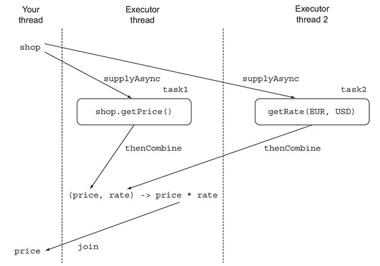

### [CHAPTER 16 CompletableFuture : 안정적 비동기 프로그래밍](https://livebook.manning.com/book/modern-java-in-action/chapter-16/)
* 이 장의 내용
    - 비동기 작업을 만들고 결과 얻기
    - 넌블록 동작으로 생산성 높이기
    - 비동기 API를 비동기적으로 소비하기
    - 동기 API를 비동기적으로 소비하기
    - 두 개 이상의 비동기 연산을 파이프라인으로 만들고 합치기
    - 비동기 작업 완료에 대응하기

#### 16.1 Future의 단순 활용
* 자바 5부터 [Future 인터페이스](https://docs.oracle.com/javase/8/docs/api/java/util/concurrent/Future.html) 를 제공
    - 비동기 계산을 모델링하는데 Future 이용
    - 계산이 끝났을 때 결과에 접근할 수 있는 참조 제공
        ``` 
        ExecutorService executor = Executors.newCachedThreadPool();
        Future<Double> future = executor.submit(()-> doSomeLongComputation());
        doSomethingElse();
        try {
            Double result = future.get(1, TimeUnit.SECONDS);
        } catch (ExecutionException ee) {
            // the computation threw an exception
        } catch (InterruptedException ie) {
            // the current thread was interrupted while waiting
        } catch (TimeoutException te) {
            // the timeout expired before the Future completion
        }
        ```
    - 
##### 16.1.1 Future 제한
* 여러 Future의 의존성을 표현하기 어려움
* 기능 요구사항
    - 비동기 계산 결과 합치기
    - Future 집합이 실행하는 모든 태스크 기다리기
    - Future 집합에서 가장 빨리 완료되는 태스크값 얻기
    - 프로그램적으로 Future를 완료
    - Future 완료 동작에 반응하여 추가 동작 수행
##### 16.1.2 CompletableFuture로 비동기 애플리케이션 만들기
* 배울 점
    - 비동기 API를 제공하는 방법
    - 동기 API를 넌블록으로 만드는 방법
    - 비동기 동작의 완료에 대응하는 방법
    
#### 16.2 비동기 API 구현
* [동기 방식으로 상점 구현](../../src/main/java/com/study/modern/ch16/ShopSync.java)
##### 16.2.1 동기 메서드를 비동기 메서드로 변환
* [비동기 방식으로 상점 구현](../../src/main/java/com/study/modern/ch16/ShopAsync.java)
##### 16.2.2 에러 처리 방법
* [비동기 방식 에러 처리 안 했을시](../../src/main/java/com/study/modern/ch16/ShopException.java)
* [비동기 방식 에러 처리 했을 시](../../src/main/java/com/study/modern/ch16/ShopExceptionally.java)
* [supplyAsync 메서드 이용](../../src/main/java/com/study/modern/ch16/ShopSupplyAsync.java)
#### 16.3 비블록 코드 만들기
* [동기 방식으로 상점 정보 요청하기](../../src/main/java/com/study/modern/ch16/nonblock/BestPriceFinder.java)
##### 16.3.1 병렬 스트림으로 요청 병렬화하기
* [병렬 스트림을 이용해 상점 정보 요청하기](../../src/main/java/com/study/modern/ch16/nonblock/BestPriceFinder.java)
##### 16.3.2 CompletableFuture로 비동기 호출 구현하기
* [CompletableFuture를 이용해 상점 정보 요청하기](../../src/main/java/com/study/modern/ch16/nonblock/BestPriceFinder.java)
    - 
##### 16.3.3 더 확장성이 좋은 해결 방법
* 병렬 스트림과 CompletableFuture 
    - 내부적으로 Runtime.getRunTime().availableProcessors()를 이용함
    - 커스텀 Executor 적용하여 스레드를 늘리는 방안 검토
##### 16.3.4 커스텀 Executor 사용하기
* 스레드는의 크기는 상점 수 만큼 구축
    - 100 이하 추천
    - [CompletableFuture에 커스텀 Executor 적용](../../src/main/java/com/study/modern/ch16/nonblock/BestPriceFinder.java)
* I/O가 포함되지 않은 계산 중심의 작업일 경우 스트림 인터페이스 효율이 좋음
* I/O가 포함된 경우 스레드 수를 조절할 수 있는 CompletableFuture가 좋음
#### 16.4 비동기 작업 파이프라인 만들기
##### 16.4.1 할인 서비스 구현
##### 16.4.2 할인 서비스 사용
* [간단한 findPrices 구현](../../src/main/java/com/study/modern/ch16/compose/BestDiscountPriceFinder.java)
##### 16.4.3 동기 작업과 비동기 작업 조합하기
* [CompletableFuture의 composing을 이용한 findPrices 구현](../../src/main/java/com/study/modern/ch16/compose/BestDiscountPriceFinder.java)
* 
##### 16.4.4 독립 CompletableFutur와 비독립 CompletableFuture 합치기
* [CompletableFuture의 combining을 이용한 findPrices 구현](../../src/main/java/com/study/modern/ch16/combine/BestExchangePriceFinder.java)
* 
    - 스레드 풀을 어떤걸 쓰냐에 따라 걸린 시간이 달라짐.
    - 스레드풀 지정안할시 forkJoinThreadPool을 쓰기때문에 하드웨어의 core개수에 영향을 받음
    - 예제에서 지정한 스레드풀을 공용으로 사용시 상점의 2배로 스레풀을 설정해 줘야함
##### 16.4.5 Future의 리플렉션과 CompletableFuture의 리플렉션
* 자바7에서의 Combining 구현
    ```
    ExecutorService executor = Executors.newCachedThreadPool();
    final Future<Double> futureRate = executor.submit(new Callable<Double>() {
        public Double call() {
            return exchangeService.getRate(Money.EUR, Money.USD);
        }});
    Future<Double> futurePriceInUSD = executor.submit(new Callable<Double>() {
        public Double call() {
            double priceInEUR = shop.getPrice(product);
            return priceInEUR * futureRate.get();
        }});
    ```
##### 16.4.6 타임아웃 효과적으로 사용하기
* 자바 9에서는 CompletableFuture에서 orTimeout 메서드 제공
    ```
    Future<Double> futurePriceInUSD =
        CompletableFuture.supplyAsync(() -> shop.getPrice(product))
        .thenCombine(
            CompletableFuture.supplyAsync(
                () ->  exchangeService.getRate(Money.EUR, Money.USD)),
            (price, rate) -> price * rate
        ))
        .orTimeout(3, TimeUnit.SECONDS);
    ```
* 기본값 적용하기
    ```
    Future<Double> futurePriceInUSD =
        CompletableFuture.supplyAsync(() -> shop.getPrice(product))
        .thenCombine(
            CompletableFuture.supplyAsync(
                () -> exchangeService.getRate(Money.EUR, Money.USD)
            ).completeOnTimeout(DEFAULT_RATE, 1, TimeUnit.SECONDS),
            (price, rate) -> price * rate
        ))
        .orTimeout(3, TimeUnit.SECONDS); 
    ```
#### 16.5 CompleatbleFuture의 종료에 대응하는 방법
* delay 개선(0.5 ~ 2.5 s)
    ```
    private static final Random random = new Random();
    public static void randomDelay() {
        int delay = 500 + random.nextInt(2000);
        try {
            Thread.sleep(delay);
        } catch (InterruptedException e) {
            throw new RuntimeException(e);
        }
    }
    ```
##### 16.5.1 최저가격 검색 애플리케이션 리팩터링
* Future Stream 반환
    ```
    public Stream<CompletableFuture<String>> findPricesStream(String product) {
        return shops.stream()
             .map(shop -> CompletableFuture.supplyAsync(
                                   () -> shop.getPrice(product), executor))
             .map(future -> future.thenApply(Quote::parse))
             .map(future -> future.thenCompose(quote ->
                  CompletableFuture.supplyAsync(
                      () -> Discount.applyDiscount(quote), executor)));
    } 
    ```
* 출력하기
    ```
    findPricesStream("myPhone").map(f -> f.thenAccept(System.out::println));
    ```
* 모든 출력 기다리기
    ```
    CompletableFuture[] futures = findPricesStream("myPhone")
        .map(f -> f.thenAccept(System.out::println))
        .toArray(size -> new CompletableFuture[size]);
    CompletableFuture.allOf(futures).join();
    ```
* 출력 하나 기다리기
    ```
    CompletableFuture[] futures = findPricesStream("myPhone")
        .map(f -> f.thenAccept(System.out::println))
        .toArray(size -> new CompletableFuture[size]);
    CompletableFuture.anyOf(futures).join();
    ```
##### 16.5.2 응용

#### 16.6 로드맵

#### 16.7 마치며