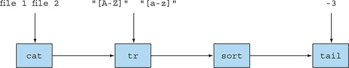

### [CHAPTER 1 자바 8, 9, 10, 11 : 무슨 일이 일어나고 있는가?](https://livebook.manning.com/book/modern-java-in-action/chapter-1/)
#### 1.1 역사의 흐름은 무엇인가?
* 버전별 병렬 실행 환경 변화
    - 자바 1.0
        - 스레드와 락, 메모리 모델 지원
    - 자바 5
        - 스레드 풀, 병렬 실행 컬렉션 도입
    - 자바 7
        - 포크/조인 프레임워크 제공
    - 자바 8
        - 병렬 실행을 새롭고 단순한 방식으로 접근할 수 있는 방법 제공
    - 자바 9
        - 리액티브 프로그래밍이라는 병렬 실행 기법 지원
        - RxJava를 표준적인 방식으로 지원
* 자바8 특징
    - 스트림 API
    - 메서드에 코드를 전달하는 기법(메소드 참조와 람다)
    - 인터페이스의 디폴트 메서드
#### 1.2 왜 아직도 자바는 변화하는가?
* 새로운 언어가 등장하면서 진화하지 않은 기존 언어는 사장되었음
##### 1.2.1 프로그래밍 언어 생태계에서 자바의 위치
* 잘 설계된 객체지향 언어로 시작
    - 스레드와 락을 이용한 동시성도 지원
* JVM 상에서 동작함
    - 브라우저에서 동작함으로써 널리 퍼짐
* 임베디드 컴퓨팅 컴퓨팅 분야를 성공적으로 장악
* 새로운 환경에 적응하기 위해 기능 추가되고 있음
##### 1.2.2 스트림 처리(stream processing)
* 스트림
    - 한 번에 한 개씩 만들어지는 연속적인 데이터 항목들의 모임
    - 프로그램은 이론적으로 한개의 입력 스트림과 출력 스트림을 가짐
    - 한 프로그램의 출력 스트림은 다른 프로그램의 입력 스트림이 될 수 있음
    - 스트림과 관련된 유닉스 명령
        - ```cat file1 file2 | tr "[A-Z]" "[a-z]" | sort | tail -3```
        - 
        - 명령어들을 병렬로 처리함
        - cat이나 tr이 완료되지 않은 시점에서 sort행을 처리하기 시작할 수 있음
* 자바에서의 스트림
    - [java.util.stream 패키지](https://docs.oracle.com/javase/8/docs/api/java/util/stream/Stream.html]) 에 스트림 API 추가
    - ```Stream<T>```는 T형식으로 구성된 일련의 항목을 의미
##### 1.2.3 동작 파라미터화로 메서드에 코드 전달하기
* 동작 파라미터화(behavior parameterization)
    - 코드 일부를 API로 전달하는 기능
    - 메서드를 다른 메서드의 인자로 넘겨주는 기능을 제공

##### 1.2.4 병력성과 공유 가변 데이터
##### 1.2.5 자바가 진화해야 하는 이유
#### 1.3 자바 함수
##### 1.3.1 메서드와 람다를 일급 시민으로
##### 1.3.2 코드 넘겨주기 : 예제
##### 1.3.3 메서드 전달에서 람다로
#### 1.4 스트림
##### 1.4.1 멀티스레딩은 어렵다
#### 1.5 디폴트 메서드와 자바 모듈
#### 1.6 함수형 프로그래밍에서 가져온 다른 유용한 아이디어
#### 1.7 마치며