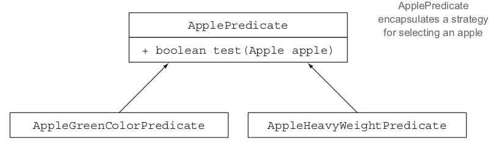
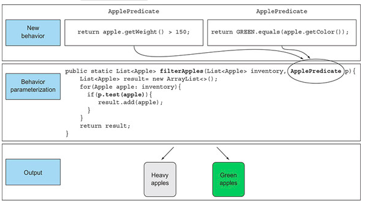
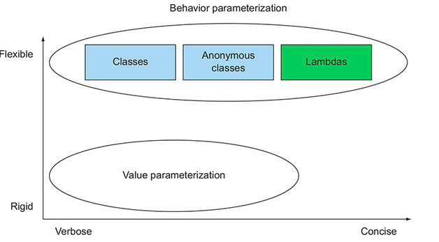

### [CHAPTER 2 동작 파라미터화 코드 전달하기](https://livebook.manning.com/book/modern-java-in-action/chapter-2/)
* 동작 파라미터화(behavior parameterization)
    - 어떻게 실행할 것인지 결정하지 않은 코드 블록을 의미
    - 자주 바뀌는 요구사항에 효과적으로 대응
#### 2.1 변화하는 요구사항에 대응하기
##### 2.1.1 첫 번째 시도 : 녹색 사과 필터링
* 녹색 사과 필터링
    ``` 
    enum Color { RED, GREEN }
    public static List<Apple> filterGreenApples(List<Apple> inventory) {
        List<Apple> result = new ArrayList<>();
        for(Apple apple: inventory){
            if( GREEN.equals(apple.getColor() ) {
                result.add(apple);
            }
        }
        return result;
    }
    ```
* 빨간 사과로 필터링을 하고 싶다면?
##### 2.1.2 두 번째 시도 : 색을 파라미터화
* 색 파라미터화
    ``` 
    public static List<Apple> filterApplesByColor(List<Apple> inventory,Color color) {
        List<Apple> result = new ArrayList<>();
        for (Apple apple: inventory) {
            if ( apple.getColor().equals(color) ) {
                result.add(apple);
            }
        }
        return result;
    }
    ```
* 다른 요소로 필터링 하고 싶다면?
##### 2.1.3 세 번째 시도 : 가능한 모든 속성으로 필터링
* 모든 속성으로 필터링
    ``` 
    public static List<Apple> filterApples(List<Apple> inventory, Color color,
                                           int weight, boolean flag) {
        List<Apple> result = new ArrayList<>();
        for (Apple apple: inventory) {
            if ( (flag && apple.getColor().equals(color)) ||
                 (!flag && apple.getWeight() > weight) ){
                result.add(apple);
            }
        }
        return result;
    }
    ```
#### 2.2 동작 파라미터화
* 프리게이트 함수 이용
    ``` 
    public interface ApplePredicate{
        boolean test (Apple apple);
    }
    public class AppleHeavyWeightPredicate implements ApplePredicate {
        public boolean test(Apple apple) {
            return apple.getWeight() > 150;
        }
    }
    public class AppleGreenColorPredicate implements ApplePredicate {
        public boolean test(Apple apple) {
            return GREEN.equals(apple.getColor());
        }
    }
    ```
    - 
##### 2.2.1 네 번째 시도 : 추상적 조건으로 필터링
* filterApples 메소드
    ``` 
    public static List<Apple> filterApples(List<Apple> inventory,ApplePredicate p) {
        List<Apple> result = new ArrayList<>();
        for(Apple apple: inventory) {
            if(p.test(apple)) {
                result.add(apple);
            }
        }
        return result;
    }
    List<Apple> redAndHeavyApples =
        filterApples(inventory, new AppleGreenColorPredicate());
    ```
    - 
#### 2.3 복잡한 과정 간소화
##### 2.3.1 익명 클래스
##### 2.3.2 다섯 번째 시도 : 익명 클래스 사용
* 익명 클래스 사용
    ``` 
    List<Apple> redApples = filterApples(inventory, new ApplePredicate() {
        public boolean test(Apple apple){
            return RED.equals(apple.getColor());
        }
    });
    ```
##### 2.3.3 여섯 번째 시도 : 람다 표현식 사용
* 람파 표현식 사용
    ``` 
    List<Apple> result =
      filterApples(inventory, (Apple apple) -> RED.equals(apple.getColor()));
    ```
* 값 파라미터 vs 동작 파라미터
    - 
##### 2.3.4 일곱 번째 시도 : 리스트 형식으로 추상화
#### 2.4 실전 예제
##### 2.4.1 Comparator로 정렬하기
##### 2.4.2 Runnable로 코드 블록 실행하기
##### 2.4.3 Callable로 결과 반환하기
##### 2.4.4 GUI 이벤트 처리하기
#### 2.5 마치며